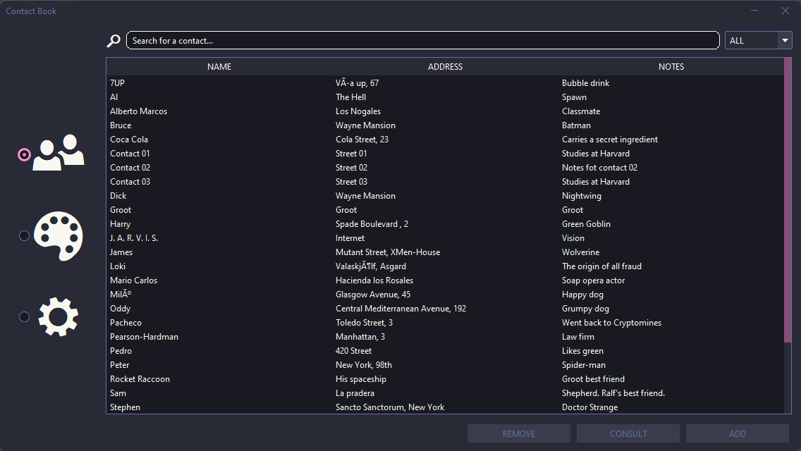
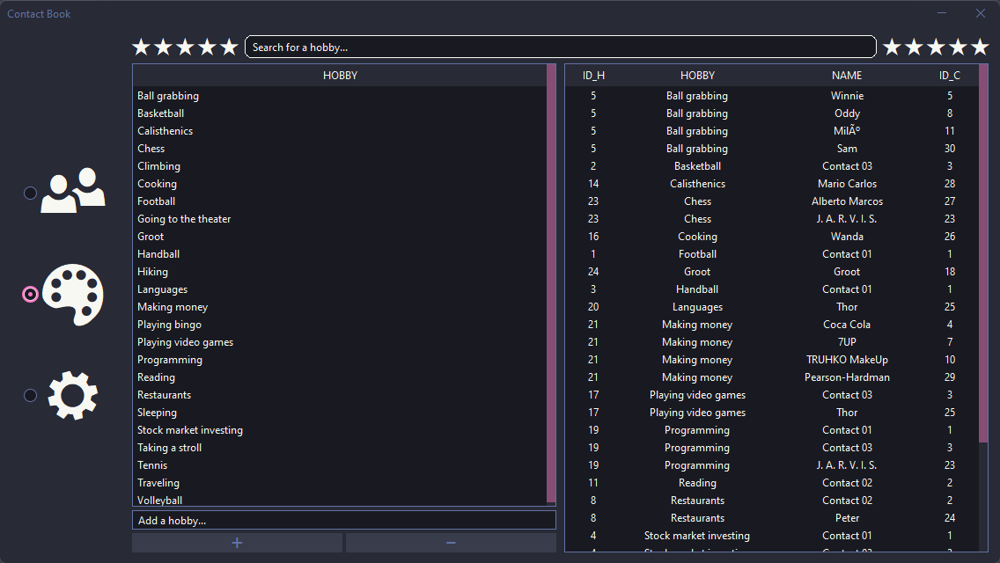
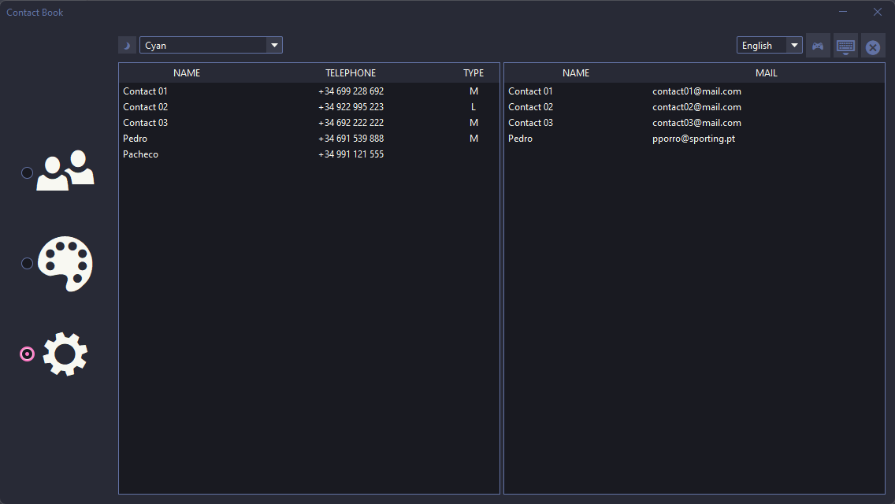
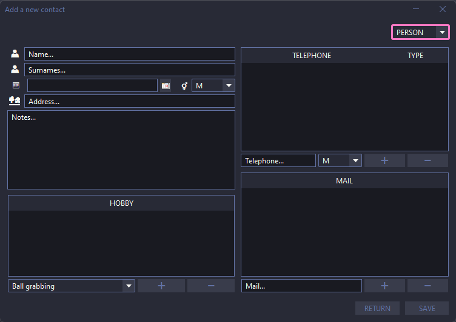
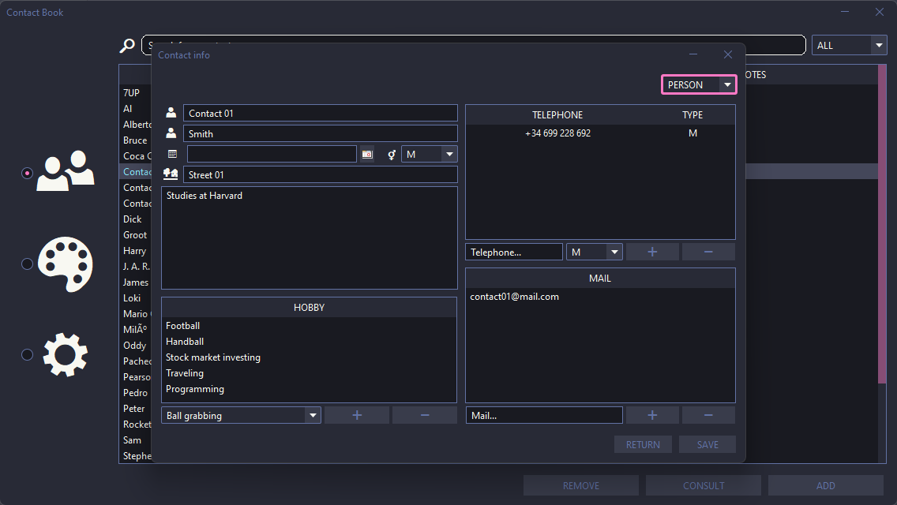

<h1 id="title" align="center"><📘> Contact Book</h1>

This is a desktop application developed with **Java Swing**.

In this application you will be able to manage your contacts and their related hobbies.

[H2 Database][H2] is used to store the data in conjunction with [Hibernate ORM][ORM] for data persistence and [Guice][G] for dependency injection.

You can access the contact book through the [graphic user interface (GUI)](#-graphic-user-interface-gui) or through the [console](#-console).

[H2]:  https://h2database.com/html/main.html
[ORM]: https://hibernate.org/orm/
[G]:   https://es.wikipedia.org/wiki/Google_Guice

## 📖 Graphic User Interface (GUI)

[ Brief description ]

[ Brief description ]

[ Brief description ]

<h3 id="create" align="center">Contacts View</h3>

<h3 id="create" align="center">Hobbies View</h3>

<h3 id="create" align="center">Settings View</h3>

<h3 id="create" align="center">Add Contact View</h3>

<h3 id="create" align="center">Contact Info View</h3>

## 🕹️ Console

// Console content

    <a href="#title">Back to top</a>

